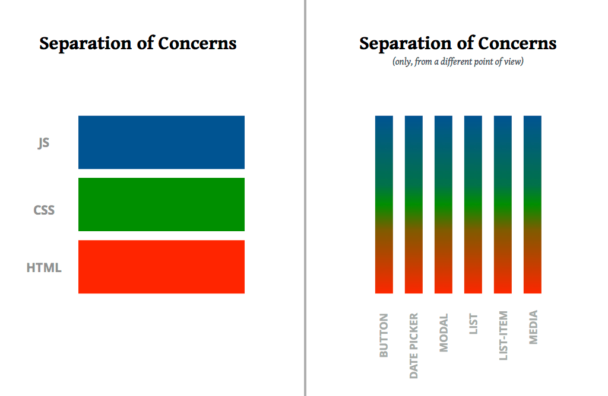

# Why you should learn React

<blockquote class="twitter-tweet" data-lang="en"><p lang="en" dir="ltr">React is such a good idea that we will spend the rest of the decade continuing to explore its implications and applications.</p>&mdash; Guillermo Rauch (@rauchg) <a href="https://twitter.com/rauchg/status/801005961334943744?ref_src=twsrc%5Etfw">November 22, 2016</a></blockquote>

A friend of mine recently said that React is the most profitable piece of technology she's ever learned. Guillermo Rauch famously tweeted React is such a great idea, we're gonna spend the next decade figuring out alll the implications.

Easy-to-use components have revolutionized how thousands of software engineers think about their code.



Personally, I like to say that React is the best thing that's happened to the web since jQuery. Remember life before jQuery?

Consider yourself lucky, if you don't! This is what JavaScript looked like before jQuery (in the good browsers) 👇

```javascript
// Togglable paragraph in old JavaScript
<div>
	<button id="showhide">Show paragraph</button>
	        
	<p id="toggleMe">This is the paragraph that is only displayed on request.</p>
</div>

<script>
  function changeDisplayState(id) {
      var d = document.getElementById('showhide'),
          e = document.getElementById(id);
      if (e.style.display === 'none' || e.style.display === '') {
          e.style.display = 'block';
          d.innerHTML = 'Hide paragraph';
      } else {
          e.style.display = 'none';
          d.innerHTML = 'Show paragraph';
      }
  }
  document.getElementById('showhide').addEventListener('click', function (e) {
      e.preventDefault();
      changeDisplayState('toggleMe');
  });
</script>
```

A lot going on, right? Imagine doing all of that every time you want to toggle some text.

jQuery made the above code a little easier 👇

```javascript
// Togglable paragraph in jQuery
<div>
	<button id="showhide">Show paragraph</button>
	        
	<p id="toggleMe">This is the paragraph that is only displayed on request.</p>
</div>

<script>
	$("#showhide").on("click", function (e) {
		e.preventDefault();
		
		if ($("#toggleMe").is(":visible")) {
			$(this).html("Show paragraph");
			$("#toggleMe").hide();
		}else{
			$(this).html("Hide paragraph");
			$("#toggleMe").show();
		}
	})
</script>
```

But that was 10 years ago, who even cares anymore right? You might. jQuery might still lurk in the deep corners of the code you work with every day. 

It made building websites so much easier, everyone used it for over 10 years!

React blew that dominance out of the water 💪

```javascript
// Togglable paragraph in React
class Toggled extends React.Component {
  state = { show: true }

  onToggle = () => this.setState({
    show: !this.state.show
  })

  render() {
    const { show } = this.state;
    
    return (
	    <div>
	      <button onClick={this.onToggle}>
	        {show ? "Hide paragraph" : "Show paragraph}
	      </button>
	      {show && <p>This is the paragraph that is only displayed on request.</p>}
	    </div>
	)
  }
}
```

Easier, right? Maybe not, it depends.

You might be thinking this is too much too soon and it is. We're going to cover everything I just showed you in the next few chapters. If you think this is easy peasy lemon squeezy, awesome! I suggest you jump ahead. You can always jump back if you jump too far  😊

## Why *I* love React

What *I* love about React is that it lets me focus on the actual app I'm building and let React handle rendering, dealing with browsers, attaching event listeners, and everything else I don't wanna worry about.

The idea is that you just develop your app and you have this rendering engine do all the hard work. A bunch of smart people work on it every day, make it better, and you benefit from their work. React just does all the hard stuff for you.


You say *"Oh, I want a button here, an icon there"* and they show up. You think in logical components, tie them together, and it just works. No need to think about how it renders.

That's the beauty of React, it takes you a level higher in your thinking.

## Community

Also, React happens to be the biggest framework library thing on the web right now. If you look at how many NPM packages there are for React, it's an order of magnitude more than any other frontend framework.

React has something like 50,000 different libraries built for it. That's a huge amount!

It means there's a gigantic community around React, a huge economy. There's a lot of jobs in React, a lot of things you can do. A lot of people putting a lot of time and money into the ecosystem.

Choose React and your job should be safe for the next several years. Maybe even a decade!

Looking at the internet, you might think the hype has left the React train, but that's just because React has become the stable reasonable choice for many companies quietly shipping real products to real customers.

That makes React the better long-term investment.

✌️