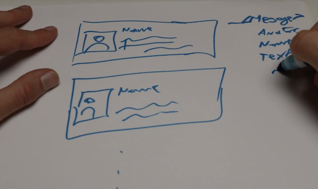

# WHY ARE COMPONENTS SO GREAT 🤔

Components are what makes React, and the other modern frameworks, so great. Easy-to-use componentization is the game changer you're here for.

But why?

You can think of components as LEGO blocks for your app. Take this glider for example 🛩

It's built out of a bunch of little LEGO pieces that you can put together to build this glider. Or something else. If we take it apart, you can see it's made out of wings, a see-through piece, a base, and so on. When you put them back together, they form something completely new and totally different.

LEGO gives you building blocks and you can turn them into _anything_.

Components are a lot like that. Pieces of pre-built functionality that you can assemble into a web app. _Any_ web app.

And unlike with LEGO, you also have a 3D printer so you can build any custom component that you need.

## Assembling web apps with components

Let's say you're building a chat app or a news feed.

You can build it as a list of messages. Each has a little avatar with a person, a name, some text, maybe a few controls.

Because messages all look the same, you can make each of them by feeding different data to a `<Message>` component. This is a completely custom component that is in turn built out of some text and an avatar.

You can further divide these into more and more (sub-)components. All the way down as deep as you want.

You're creating building blocks that you can reuse anywhere in your app, in your other apps, or even open source for the whole world to use.

The best part is that you can work on each component all on its own. You work on that component, you tinker and you tweak until it's perfect, specialized for just one thing, and amazing. Then reuse it everywhere.

And if you build it right, a component works the same in every part of your app. Good components are a pure translation of props into HTML.

More about that later 🤓

For now, just keep in mind that components give you 👇

* composability, building blocks you can assemble into anything
* encapsulation, components have clear APIs so you never have to worry about internals
* reusability, build it once, use it everywhere

You can build a huge ecosystem of components that everybody can reuse. Dropdown components, search components, button components, all these different things that are like LEGO blocks for you to use.

Components are awesome. Definitely the future of how we're building web apps. 🤘
